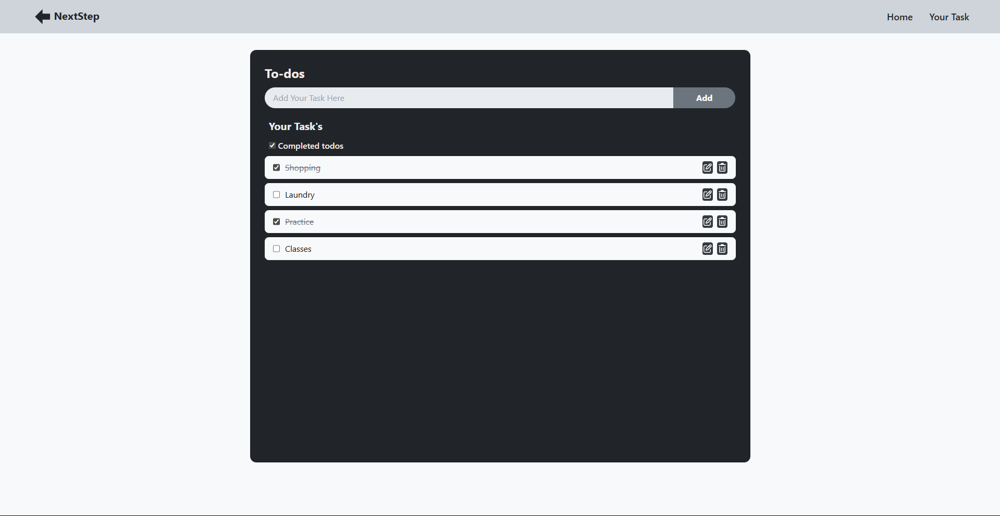

# 📌 NextStep

**NextStep** is a simple and intuitive task management app designed to help users stay organized and focused. It allows users to create, edit, complete, and manage to-do items effortlessly. With a clean UI and smooth user interactions, it's perfect for daily productivity tracking.

## 🔧 Features

- 📝 Add, edit, and delete tasks  
- ✅ Mark tasks as completed  
- 💾 LocalStorage support to retain tasks across sessions  
- 🎯 Minimalist UI with focus on usability  
- ⚛️ Built using React and modern JavaScript  

 📸 Screenshot

